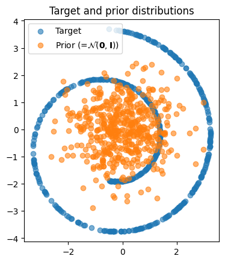
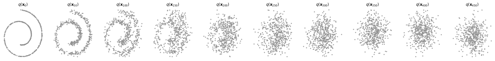
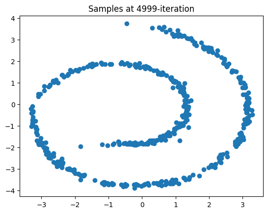
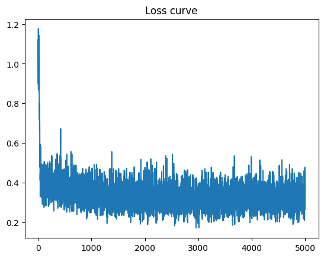
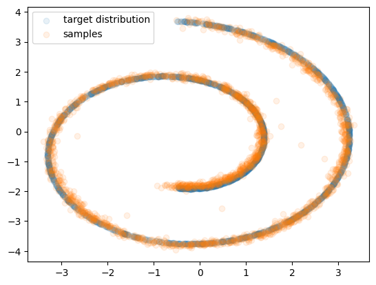
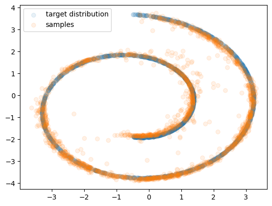
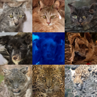
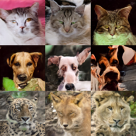
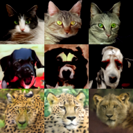

# Denoising Diffusion Implicit Models (DDIM) & Classifier-Free Guidance (CFG)

## 개요
KAIST CS492(D): Diffusion Models and Their Applications (Fall 2024)
Programming Assignment 2

## Task 1: 2D Swiss-Roll DDPM & DDIM

## 구현 내용

### 1. DDIM (Denoising Diffusion Implicit Models)
**파일**: `2d_plot_diffusion_todo/ddpm.py`
- `ddim_p_sample()`: DDIM의 한 스텝 역과정 (xt → xt-1)
  - x0 예측: x0_pred = (xt - √(1-ᾱt) * εθ) / √ᾱt
  - variance 계산: σt = η * √(variance)
  - Direction pointing: dir_xt = √(1-ᾱt-1-σt²) * εθ
  - eta=0일 때 deterministic, eta=1일 때 DDPM과 동일
  
- `ddim_p_sample_loop()`: DDIM 전체 샘플링 루프
  - 50 스텝으로 빠른 샘플링 (DDPM의 1000 스텝 대비 20배 빠름)
  - step_ratio로 timestep 건너뛰기

### 실행 결과

#### 1. Target & Prior 분포

- Swiss-roll 타겟 분포와 가우시안 prior 분포 시각화

#### 2. Forward Process (q(x_t))

- t=0부터 t=1000까지 점진적으로 노이즈가 추가되는 과정

#### 3. Training Progress

<table>
<tr>
<td></td>
<td></td>
</tr>
<tr>
<td align="center"><b>Training Samples at 4999 iter</b></td>
<td align="center"><b>Loss Curve</b></td>
</tr>
</table>

- 5000 iteration 학습
- **최종 loss: 0.3943**
- 학습 속도: 136.11it/s (총 36초 소요)

#### 4. 최종 평가 - 생성된 분포 비교

<table>
<tr>
<td></td>
<td></td>
</tr>
<tr>
<td align="center"><b>DDPM (1000 steps)</b></td>
<td align="center"><b>DDIM (50 steps)</b></td>
</tr>
<tr>
<td align="center">Chamfer Distance: <b>17.7066</b> <br>(목표: < 20)</td>
<td align="center">Chamfer Distance: <b>34.6407</b> <br>(목표: < 60)</td>
</tr>
<tr>
<td align="center">타겟 분포와 생성된 샘플이 정확히 일치</td>
<td align="center">20배 빠른 속도<br>합리적인 품질 유지</td>
</tr>
</table>

## Task 2: Classifier-Free Guidance (CFG)

### 구현 내용

#### 1. Class Conditioning (`image_diffusion_todo/network.py`)
- One-hot encoding으로 클래스 라벨 처리
- Timestep embedding과 class embedding 결합
- `temb = temb + cemb`로 조건부 정보 통합

#### 2. CFG Training (`image_diffusion_todo/network.py`)
- `cfg_dropout` 확률로 class label을 null(0)로 교체
- 모델이 conditional과 unconditional 둘 다 학습
```python
mask = torch.rand(...) < self.cfg_dropout
class_label = torch.where(mask, torch.zeros_like(...), class_label)
```

#### 3. CFG Sampling (`image_diffusion_todo/model.py`)
- Batch를 2배로 늘려 unconditional/conditional 동시 계산
- CFG 수식 적용: 
```python
noise_pred = noise_pred_uncond + guidance_scale * (noise_pred_cond - noise_pred_uncond)
```
- guidance_scale(w) 조절로 생성 품질과 다양성 trade-off

### CFG 핵심 개념
- **w=0**: unconditional only (클래스 무시)
- **w=1**: balanced guidance
- **w>1**: strong guidance (더 선명하지만 다양성 감소)

### 실행 결과

#### FID 점수 (AFHQ 데이터셋)
| CFG Scale | FID Score | 평가 |
|-----------|-----------|------|
| 0.0 (No Guidance) | **9.61** | 우수 (< 30) |
| 3.0 (Moderate) | **3.74** | 우수 (< 30) |
| 7.5 (Strong) | **2.40** | 우수 (< 30) |

**Task 2 채점: 10점/10점** - 모든 CFG scale에서 FID < 30 달성

#### CFG Scale별 생성 결과

##### CFG 0.0 (No Guidance)


*노이즈가 있지만 다양한 텍스처, 클래스 경계 모호*

##### CFG 3.0 (Moderate Guidance)


*품질과 다양성의 균형, 자연스러운 이미지*

##### CFG 7.5 (Strong Guidance)


*높은 품질, 선명한 디테일, 명확한 클래스별 특징 (상단: Cat, 중단: Dog, 하단: Wild)*

#### CFG Scale 효과 비교 (동일 시드)

##### Cat 클래스 (Label=1)


*Cat 클래스: CFG 0.0 (왼쪽) → 3.0 (중앙) → 7.5 (오른쪽)*

##### Dog 클래스 (Label=2)


*Dog 클래스: CFG 0.0 (왼쪽) → 3.0 (중앙) → 7.5 (오른쪽)*

##### Wild 클래스 (Label=3)


*Wild 클래스: CFG 0.0 (왼쪽) → 3.0 (중앙) → 7.5 (오른쪽)*

#### 관찰 결과
- **CFG 0.0**: 노이즈가 많고 클래스 경계가 모호함
- **CFG 3.0**: 자연스러운 이미지, 적절한 디테일
- **CFG 7.5**: 매우 선명하고 클래스별 특징이 강조됨

#### 핵심 발견사항
- **클래스 라벨 매핑**: 학습 시 `label_offset=1`로 인해 Cat=1, Dog=2, Wild=3으로 매핑됨
- **CFG 효과**: guidance_scale이 증가할수록 이미지 품질과 클래스 일관성 향상
- **최적 CFG**: 7.5에서 가장 낮은 FID (2.40) 달성

#### 학습 환경
- **학습 스텝**: 100,000 steps
- **Batch Size**: 8 (학습), 16 (샘플링)
- **CFG Dropout**: 0.1
- **학습 시간**: 약 15시간

## 프로젝트 구조
```
DDIM-CFG_Practice/
├── 2d_plot_diffusion_todo/    # Task 1: DDIM 구현
│   ├── ddpm.py                # DDIM 샘플링 구현
│   ├── ddpm_tutorial.ipynb    # 실습 노트북
│   ├── dataset.py             # 2D 데이터셋 (Swiss-roll)
│   ├── network.py             # 노이즈 예측 네트워크
│   └── chamferdist.py         # Chamfer Distance 측정
├── image_diffusion_todo/      # Task 2: CFG 구현
│   ├── train.py               # 학습 스크립트
│   ├── sampling.py            # 샘플링 스크립트
│   ├── model.py               # CFG 샘플링 구현
│   ├── network.py             # Class conditioning 구현
│   ├── module.py              # Diffusion 모듈
│   ├── scheduler.py           # Noise scheduler
│   ├── dataset.py             # 이미지 데이터셋 로더
│   └── fid/                   # FID 측정 도구
│       ├── inception.py
│       └── measure_fid.py
├── output/                    # 실행 결과 이미지
└── assets/                    # 참고 자료
    └── summary_of_DDPM_and_DDIM.pdf
```
## 실행 방법

### Task 1: 2D Swiss-Roll
Jupyter Notebook 실행: `2d_plot_diffusion_todo/ddpm_tutorial.ipynb`

### Task 2: Image Diffusion  
```bash
# 학습
python image_diffusion_todo/train.py --use_cfg

# 샘플링
python image_diffusion_todo/sampling.py --use_cfg
```

## 참고 자료
- [Denoising Diffusion Probabilistic Models (DDPM)](https://arxiv.org/abs/2006.11239)
- [Denoising Diffusion Implicit Models (DDIM)](https://arxiv.org/abs/2010.02502)
- [Understanding Diffusion Models: A Unified Perspective](https://arxiv.org/abs/2208.11970)

## 원본 저장소
https://github.com/KAIST-Visual-AI-Group/Diffusion-Assignment2-DDIM-CFG

## 저작권
모든 저작권은 원본 저장소(KAIST Visual AI Group)에 있음
