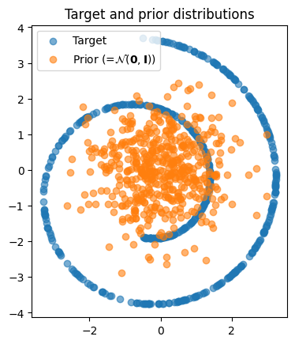
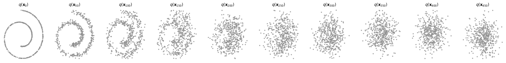
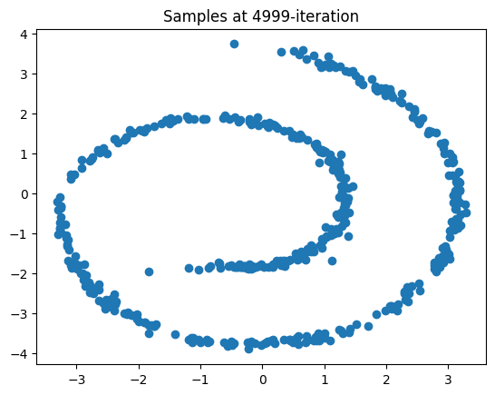
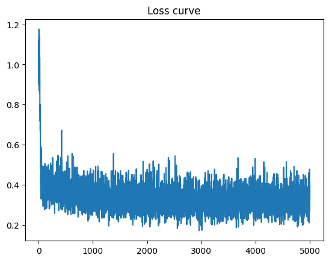
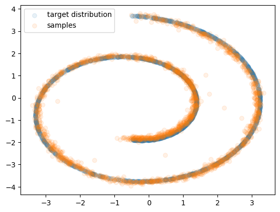

# Denoising Diffusion Implicit Models (DDIM) & Classifier-Free Guidance (CFG)

## 개요
KAIST CS492(D): Diffusion Models and Their Applications (Fall 2024)
Programming Assignment 2

## Task 1: DDIM (Denoising Diffusion Implicit Models)

### 구현 내용
#### `2d_plot_diffusion_todo/ddpm.py` - DDIM Sampling 구현
- `ddim_p_sample()`: DDIM의 한 스텝 역과정 (xt → xt-1)
  - x0 예측: x0_pred = (xt - √(1-ᾱt) * εθ) / √ᾱt
  - variance 계산: σt = η * √(variance)
  - Direction pointing: dir_xt = √(1-ᾱt-1-σt²) * εθ
  - eta=0일 때 deterministic, eta=1일 때 DDPM과 동일
  
- `ddim_p_sample_loop()`: DDIM 전체 샘플링 루프
  - 50 스텝으로 빠른 샘플링 (DDPM의 1000 스텝 대비 20배 빠름)
  - step_ratio로 timestep 건너뛰기

### 실행 결과

#### 1. 학습 과정

- 5000 iteration 학습
- **최종 loss: 0.3943**
- 학습 속도: 136.11it/s (총 36초 소요)

#### 2. DDPM 샘플링 결과

- 1000 스텝 full denoising
- **DDPM Chamfer Distance: 17.7066** ✅

#### 3. DDIM 샘플링 결과  

- 50 스텝 accelerated sampling
- **DDIM Chamfer Distance: 34.6407**
- 속도는 20배 빠르지만 품질 trade-off 존재

#### 4. 생성된 분포 비교


- Swiss-roll 패턴 재현
- DDPM이 더 정확하지만 DDIM도 합리적인 품질

## Task 2: Classifier-Free Guidance (CFG)

### 구현 내용

#### 2-1. Class Conditioning (`image_diffusion_todo/network.py`)
- One-hot encoding으로 클래스 라벨 처리
- Timestep embedding과 class embedding 결합
- `temb = temb + cemb`로 조건부 정보 통합

#### 2-2. CFG Training (`image_diffusion_todo/network.py`)
- `cfg_dropout` 확률로 class label을 null(0)로 교체
- 모델이 conditional과 unconditional 둘 다 학습
```python
mask = torch.rand(...) < self.cfg_dropout
class_label = torch.where(mask, torch.zeros_like(...), class_label)
```

#### 2-3. CFG Sampling (`image_diffusion_todo/model.py`)
- Batch를 2배로 늘려 unconditional/conditional 동시 계산
- CFG 수식 적용: 
```python
noise_pred = noise_pred_uncond + guidance_scale * (noise_pred_cond - noise_pred_uncond)
```
- guidance_scale(w) 조절로 생성 품질과 다양성 trade-off

### CFG 핵심 개념
- **w=0**: unconditional only (클래스 무시)
- **w=1**: balanced guidance
- **w>1**: strong guidance (더 선명하지만 다양성 감소)

### 실행 결과
(학습 진행 예정)

## 원본 저장소
https://github.com/KAIST-Visual-AI-Group/Diffusion-Assignment2-DDIM-CFG

## 저작권
모든 저작권은 원본 저장소(KAIST Visual AI Group)에 있음